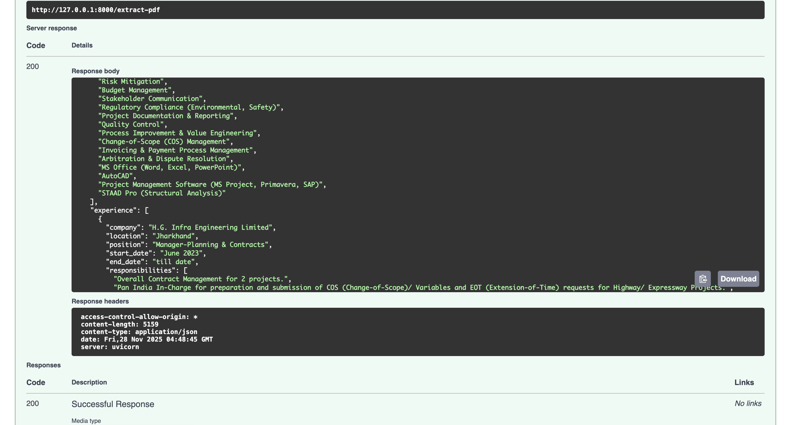
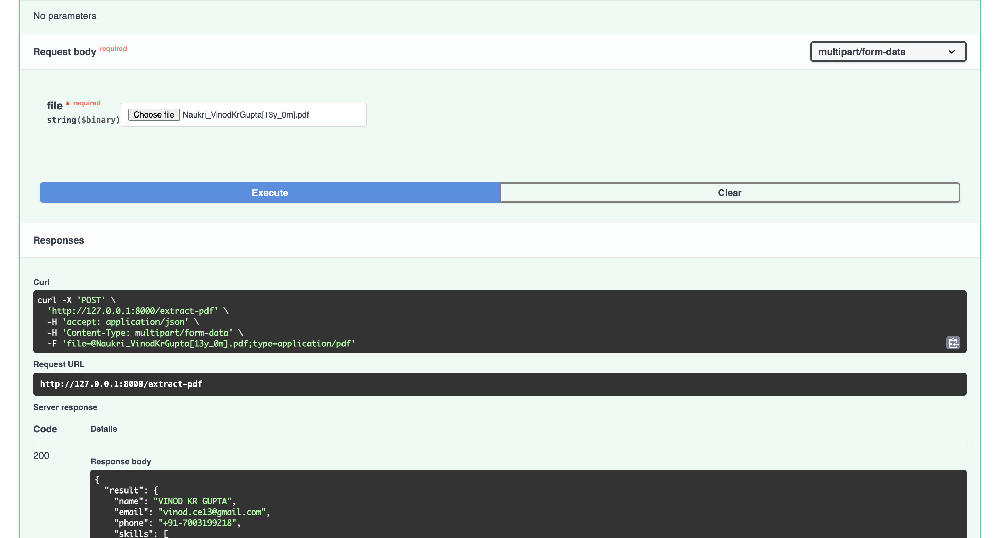
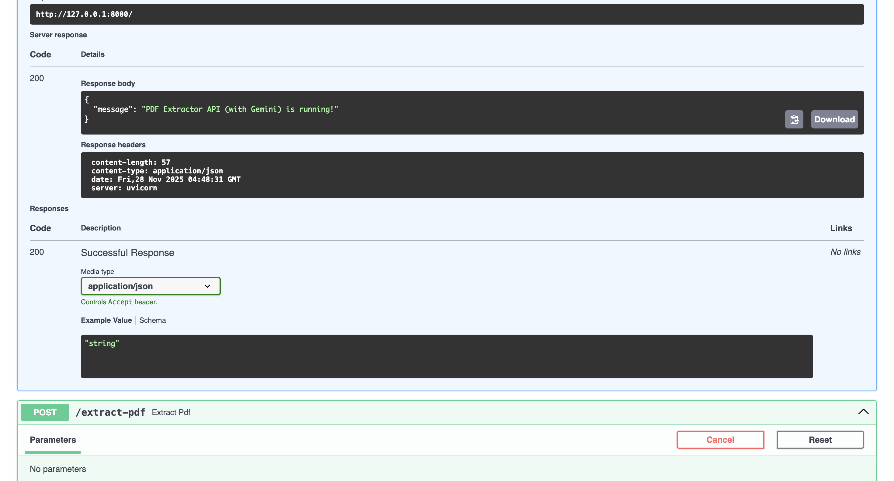

# FastAPI CV Parser

This is a **FastAPI** project that extracts information from CVs/PDF resumes using Gemini.

---

## Features

- Extracts name, email, phone, skills, experience, projects, and education from PDFs.
- Returns results as JSON.

---

## Example Outputs

### Screenshots

  
  
  
  
  

### Sample JSON

[Download Sample Output JSON](response_1764305345072.json)

