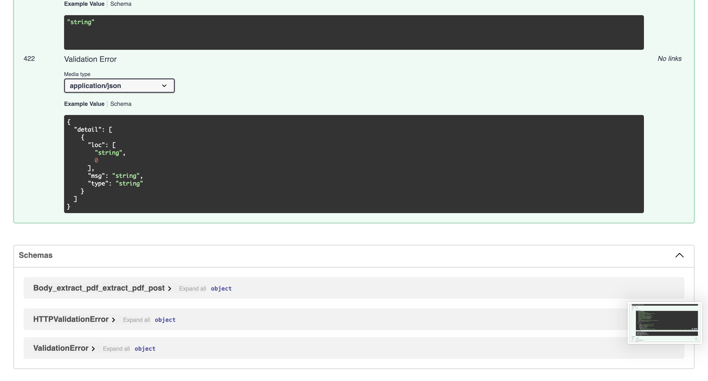
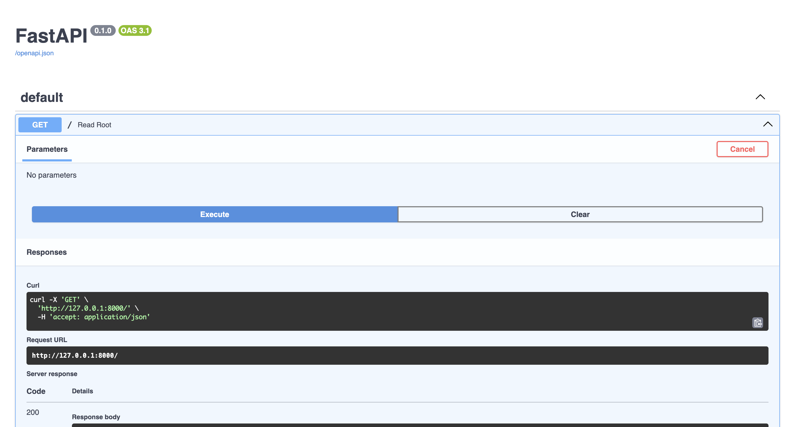

# FastAPI CV Parser

This repository contains a FastAPI application that extracts information from PDF CVs using Gemini models.

## PDF Extraction Output

Examples of parsed CVs:

  
  
  
  
  

Download a sample JSON output of a parsed CV:  
[Sample Output JSON](response_1764305345072.json)

## Usage

1. Clone the repository:
   ```bash
   git clone <repo-url>
